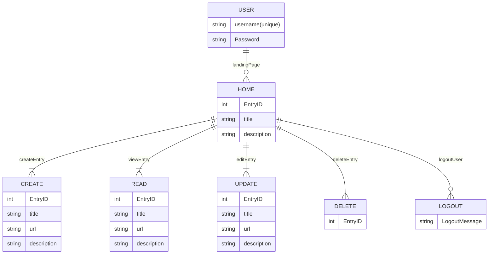

# PROJECT 3

- **Project Name:** Bookmark'D
- **Project By:** Isaac Asher, Yuna Pahk, Haleh Bozorgnia, and Nyijia Morgan
- [**LINK TO GITHUB**](https://github.com/yunapahk/Group-Project/tree/main/backend)
- [**LINK TO DEPLOYED WEBSITE**](https://bookmarkd-504g.onrender.com)
- **Languages, Database, and Frameworks Used:** React, Express, Node, MongoDB, SASS, EJS, JSX, Javascript
- [**LINK TO TRELLO**](https://trello.com/b/dVAobCJu/bookmarkd)

## Description

BookmarkD is an app That was created in order for its users to be able to take notes on any topic of their choosing and organize these notes seperately. As A User, I will initially be taken to a page with an option to login or signup. Once logged into my account, I can see my list of All of the notes that I've added shown as an Icon. Users can also access each individual note that is in their library on a seperate page. 

Each Note in a users library can be edited & updated. There will also be an option to add new notes as well as delete current ones. 

## Mock UP of UI
***Main Page***

(https://i.imgur.com/uj97OVb.png)

***Signup/Login***

(https://i.imgur.com/mJRTfrW.png)

***Dashboard***

(https://i.imgur.com/tkD1pkA.png)

***Messaging***

([Socket.io](https://i.imgur.com/slb8vk1.png))

## List of Backend Endpoints

| ROUTE NAME | ENDPOINT | METHOD | PURPOSE |
|------------|----------|--------|---------|
| Index | /note | GET | Display list of all my Notes |
| Create | /note | POST |  Creates a New Note in my library |
| Show | /note/:id | GET | Display's one specific Notes details |
| Update | /note/:id | PUT | Updates a specific Note in my library |
| Destroy | /note/:id | DELETE | Deletes a Specific Note in my library |
   
## ERD (ENTITY RELATIONSHIP DIAGRAM)

---

## Enhancements Not Yet Completed

- Implement Basic User Model 

- Implement Auth

- Allow Username & Password to be changed

- Allow for users to delete their account

- Create User Profile Page

- Implement more properties for user data model (E.g. Profile Picture, age, location,etc)

- Allow users to sign up/Login using their social accounts (FB, Twitter, Google, etc) using 0auth
